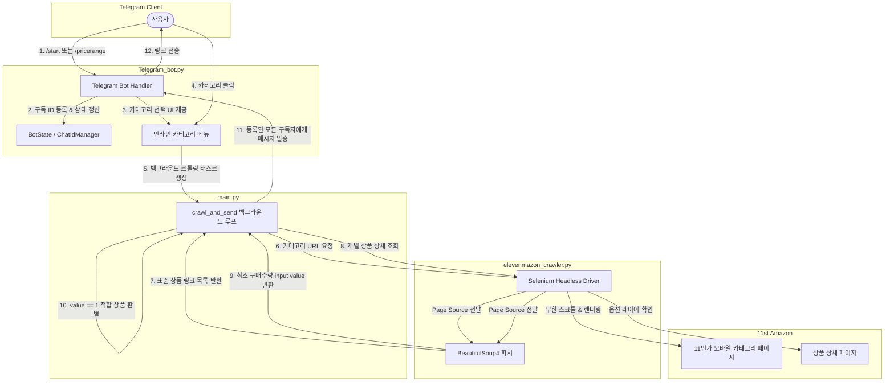
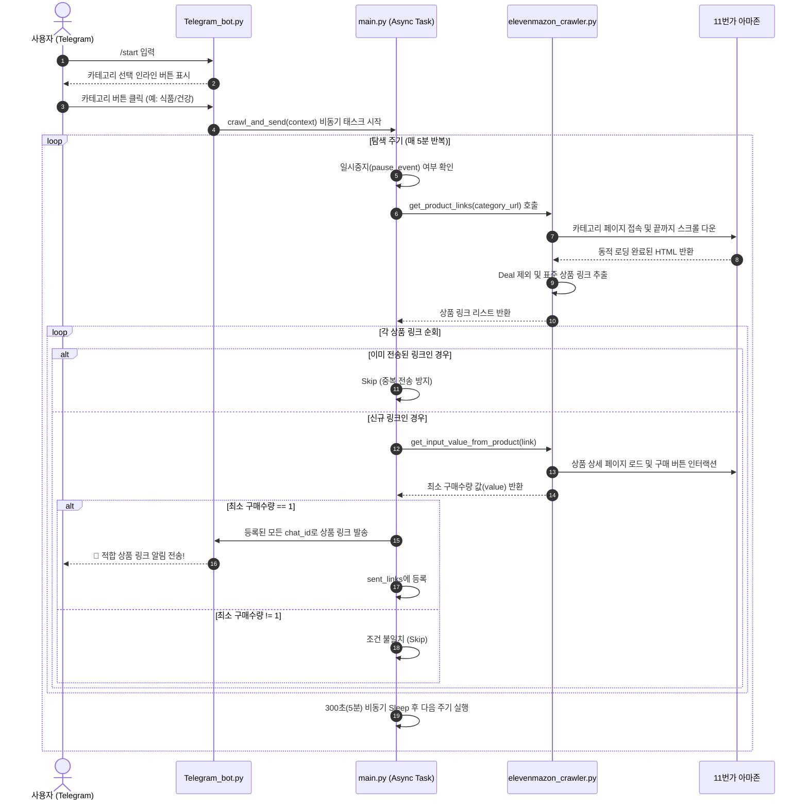

# 11mazon_CherryPicker_Telegram_Bot 🍒🤖

> **11번가 아마존(11마존)의 조건 맞춤형 체리피킹 상품을 실시간으로 탐색하여 텔레그램으로 전송해 주는 자동화 봇입니다.**

[](https://www.python.org/)
[](https://python-telegram-bot.org/)
[](https://www.selenium.dev/)
[](LICENSE)

---

## 📅 개발 및 운영 기간
- 2025년 6월 29일 ~ 2026년 6월 30일 
- 2026년 7월 이후 11번가 아마존 제휴 종료로 인한 개발 종료

---

## 📌 목차
1. [프로젝트 소개](#-프로젝트-소개)
2. [주요 기능](#-주요-기능)
3. [시스템 워크플로](#-시스템-워크플로)
4. [프로젝트 구조](#-프로젝트-구조)
5. [설치 및 실행 방법](#-설치-및-실행-방법)
6. [텔레그램 명령어 안내](#-텔레그램-명령어-안내)
7. [기술 스택](#-기술-스택)
8. [로드맵 및 개선 계획](#-로드맵-및-개선-계획)
9. [라이선스](#-라이선스)

---

## 📖 프로젝트 소개

11번가 아마존(11마존) 서비스 이용 시 무료 배송 기준을 맞추거나 쿠폰 적용을 위해 특정 가격대의 **가성비 상품(체리피킹 상품)**을 탐색하는 것은 번거로운 작업입니다.

**11mazon_CherryPicker_Telegram_Bot**은 다음 조건을 만족하는 상품을 자동으로 크롤링하여 사용자에게 실시간 텔레그램 링크 알림을 발송합니다:
- **가격 조건**: 사용자가 지정한 가격 범위 (기본값: `5,000 KRW ~ 7,000 KRW`)
- **최소 구매 수량 조건**: 최소 구매 수량이 **1개**인 단품 구매 가능 상품 (대량 묶음 구매 강제 상품 제외)
- **카테고리별 맞춤 필터링**: 전체, 식품/건강, 가전/디지털, 컴퓨터 카테고리 지원

---

## 💡 개발 배경

과거 SKT 우주패스에서는 11번가 아마존에서 사용할 수 있는 5천원 이상 구매 시 5천원 할인 쿠폰을 제공했습니다.
이후 일부 상품에 최소 구매 수량 조건이 추가되었지만, 간혹 제한 없이 1개만 구매 가능한 상품이 존재했습니다.
이런 상품을 찾으려면 수많은 상세 페이지를 직접 확인해야 해 시간 소모가 컸습니다.
그래서 최소 구매 수량이 1개인 상품을 자동으로 탐색·필터링하도록 프로그램을 개발했습니다.

---

## ✨ 주요 기능

### 1. 실시간 타깃 크롤링 및 무한 스크롤 지원
- 11번가 모바일 웹 페이지에 접속하여 무한 스크롤을 통해 페이지 내 상품 목록을 모두 렌더링 후 수집합니다.
- 단순 광고/딜 묶음 블록(`Deal`)을 제외하고 실제 구매 가능한 표준 상품 그리드(`ProductGrid_Standard`) 링크만 선별 추출합니다.

### 2. 최소 구매 수량(1개) 정밀 검증
- 상품 목록에서 추출한 링크의 상세 페이지에 개별 접속하여 옵션/구매 레이어를 분석합니다.
- 장바구니/구매 수량 `input` 필드의 기본 `value` 값이 **1**인지 판별하여, 최소 구매 수량이 1개인 체리피킹 적합 상품만 정확하게 필터링합니다.

### 3. 유연한 가격 범위(Price Range) 동적 설정
- 기본 설정(`5,000원 ~ 7,000원`) 외에도 텔레그램 대화창에서 `/pricerange` 명령어를 통해 실시간으로 원하는 가격대(예: `1000~3000`, `10000~15000`)를 설정할 수 있습니다.
- 가격 변경 시 탐색 URL의 쿼리 파라미터(`fromPrice`, `toPrice`)가 동적으로 갱신됩니다.

### 4. 텔레그램 인라인 버튼 UI & 인터랙티브 제어
- `/start` 명령어 실행 시 텔레그램 인라인 키보드(Inline Keyboard)로 카테고리 선택 메뉴를 제공합니다.
- `asyncio.Event` 기반의 비동기 제어로 탐색 중 언제든지 `/pause`(일시중지), `/continue`(재개), `/stop`(중단), `/restart`(다시 시작)가 가능합니다.

### 5. 다중 사용자 구독 관리 & 세션 복구
- 봇에 명령어를 전송한 모든 사용자의 `chat_id`를 `chat_ids.json` 파일에 영속적으로 저장하고 관리합니다.
- 봇을 차단하거나 탈퇴한 유저에게 알림 전송 실패 시 해당 ID를 자동으로 정리하여 봇의 안정성을 유지합니다.
- 이미 전송된 상품 링크는 세션 내 캐싱(`sent_links`)하여 중복 알림을 방지합니다.

---

## 🔄 시스템 워크플로

### 1. 전체 아키텍처 및 데이터 흐름



---

### 2. 세부 크롤링 & 알림 파이프라인



---

## 📁 프로젝트 구조

```plaintext
11mazon_CherryPicker_Telegram_Bot/
├── .gitignore                      # Git 추적 제외 목록 (.env, 캐시, JSON 등)
├── LICENSE                         # MIT 라이선스
├── README.md                       # 프로젝트 종합 안내 문서
├── Refactoring_Specification.md    # Selenium -> Playwright 교체 리팩토링 명세서
├── pyproject.toml                  # 프로젝트 메타데이터 및 의존성 정의
├── chat_ids.json                   # 알림 구독자 Chat ID 저장소 (자동 생성)
│
├── main.py                         # 애플리케이션 진입점 및 크롤링-전송 비동기 루프
├── Telegram_bot.py                 # 텔레그램 봇 핸들러, 상태 관리, 명령어 및 UI
└── elevenmazon_crawler.py          # Selenium 기반 웹 크롤러 및 HTML 파싱 로직
```

### 핵심 모듈 설명
- **[main.py](file:///D:/HongDev/ELSAPHABA/11mazon_CherryPicker_Telegram_Bot/main.py)**: 환경변수를 로드하고 텔레그램 봇을 실행합니다. `crawl_and_send` 코루틴을 통해 주기적으로 크롤러를 구동하고, 구독자들에게 메시지를 비동기 브로드캐스트합니다.
- **[Telegram_bot.py](file:///D:/HongDev/ELSAPHABA/11mazon_CherryPicker_Telegram_Bot/Telegram_bot.py)**: 봇 커맨드 핸들러, `ChatIdManager`(구독자 파일 영속화), `BotState`(실행/일시정지/가격설정 상태), 카테고리 URL 빌더 및 인라인 키보드 UI를 제공합니다.
- **[elevenmazon_crawler.py](file:///D:/HongDev/ELSAPHABA/11mazon_CherryPicker_Telegram_Bot/elevenmazon_crawler.py)**: Chrome Headless 드라이버를 통해 무한 스크롤 상품 수집(`get_product_links`) 및 상세 페이지의 최소 구매 수량 추출(`get_input_value_from_product`)을 담당합니다.

---

## 🚀 설치 및 실행 방법

### 1. 요구사항
- **Python**: 3.9 이상
- **Google Chrome**: 최신 버전 브라우저 설치 필요 (Selenium Chrome WebDriver 구동용)

### 2. 저장소 클론 및 환경 설정

```bash
# 1. 저장소 클론
git clone https://github.com/ELSAPHABA/11mazon_CherryPicker_Telegram_Bot.git
cd 11mazon_CherryPicker_Telegram_Bot

# 2. 가상환경 생성 및 활성화 (선택 사항)
python -m venv venv
# Windows (PowerShell)
.\venv\Scripts\Activate.ps1
# macOS / Linux
source venv/bin/activate

# 3. 의존성 패키지 설치
pip install -e .
# 또는 개별 설치:
# pip install python-telegram-bot>=22.5 selenium beautifulsoup4 webdriver-manager python-dotenv
```

### 3. 환경 변수 설정 (`.env`)
프로젝트 루트 디렉토리에 `.env` 파일을 생성하고, Telegram BotFather로부터 발급받은 봇 토큰을 입력합니다.

```env
TELEGRAM_BOT_TOKEN=your_telegram_bot_token_here
```

### 4. 봇 실행

```bash
python main.py
```

실행 후 콘솔에 `Bot Started!` 메시지가 표시되면 텔레그램 앱에서 봇에게 대화를 걸어 탐색을 시작할 수 있습니다.

---

## 💬 텔레그램 명령어 안내

| 명령어 | 설명 | 사용 예시 |
| :--- | :--- | :--- |
| `/start` | 탐색을 시작합니다. 카테고리 선택 인라인 버튼이 출력됩니다. | `/start` |
| `/help` | 봇 사용 방법 및 명령어 안내 목록을 출력합니다. | `/help` |
| `/pricerange` | 탐색할 상품의 가격 범위를 변경합니다. (기본: `5000~7000`) | `/pricerange` 입력 후 `4000~6000` 전송 |
| `/pause` | 현재 진행 중인 크롤링 탐색을 일시중지합니다. | `/pause` |
| `/continue` | 일시중지된 크롤링 탐색을 재개합니다. | `/continue` |
| `/stop` | 진행 중인 탐색을 완전히 중단하고 상태를 초기화합니다. | `/stop` |
| `/restart` | 진행 중인 상태를 리셋하고 카테고리 선택부터 다시 시작합니다. | `/restart` |

### 지원 카테고리 목록
1. **전체**: 11마존 전체 카테고리 인기순
2. **식품/건강**: 식품 및 건강기능식품 카테고리
3. **가전/디지털**: 소형가전, 음향기기, 디지털 기기 카테고리
4. **컴퓨터**: PC 부품 및 주변기기 카테고리

---

## 🛠 기술 스택

- **언어**: Python 3.9+
- **메신저 프레임워크**: [`python-telegram-bot`](https://github.com/python-telegram-bot/python-telegram-bot) (v22.5+)
- **웹 크롤링 & 브라우저 자동화**:
  - [`Selenium`](https://www.selenium.dev/) (Chrome Headless)
  - [`webdriver-manager`](https://github.com/SergeyPirogov/webdriver_manager) (드라이버 자동 관리)
  - [`BeautifulSoup4`](https://www.crummy.com/software/BeautifulSoup/) (HTML 파싱)
- **비동기 & 동시성 처리**: `asyncio` (`asyncio.Event`, `create_task`)
- **설정 및 환경 관리**: `python-dotenv`

---

## 🗺 로드맵 및 개선 계획

- [ ] **크롤러 엔진 현대화**: 리소스를 많이 소모하는 Selenium을 비동기 고성능 라이브러리인 **Playwright**로 교체 ([Refactoring_Specification.md](file:///D:/HongDev/ELSAPHABA/11mazon_CherryPicker_Telegram_Bot/Refactoring_Specification.md) 참조)
- [ ] **반응 속도 개선**: `/pause`, `/resume`, `/stop` 제어 시 드라이버 작업 완료를 기다리지 않고 즉각 반응하도록 태스크 취소 로직 고도화
- [ ] **탐색 카테고리 확장**: 패션, 뷰티, 스포츠/레저, 홈/인테리어 등 다양한 서브 카테고리 추가
- [ ] **봇 인터페이스를 통한 세부 필터링**: 할인율, 배송 조건, 정렬 기준 등을 텔레그램 명령어로 커스텀 설정
- [ ] **보안 및 우회 기능**: User-Agent 로테이션, 헤더 최적화, 프록시 풀 연동을 통한 캡차(CAPTCHA) 방지
- [ ] **URL 최적화**: 모바일 전용 URL(`m.11st.co.kr`)을 PC 친화적 웹 URL로 자동 변환하여 전송하는 기능 추가

---

## 📄 라이선스

이 프로젝트는 [MIT License](LICENSE)에 따라 자유롭게 수정 및 배포할 수 있습니다.
